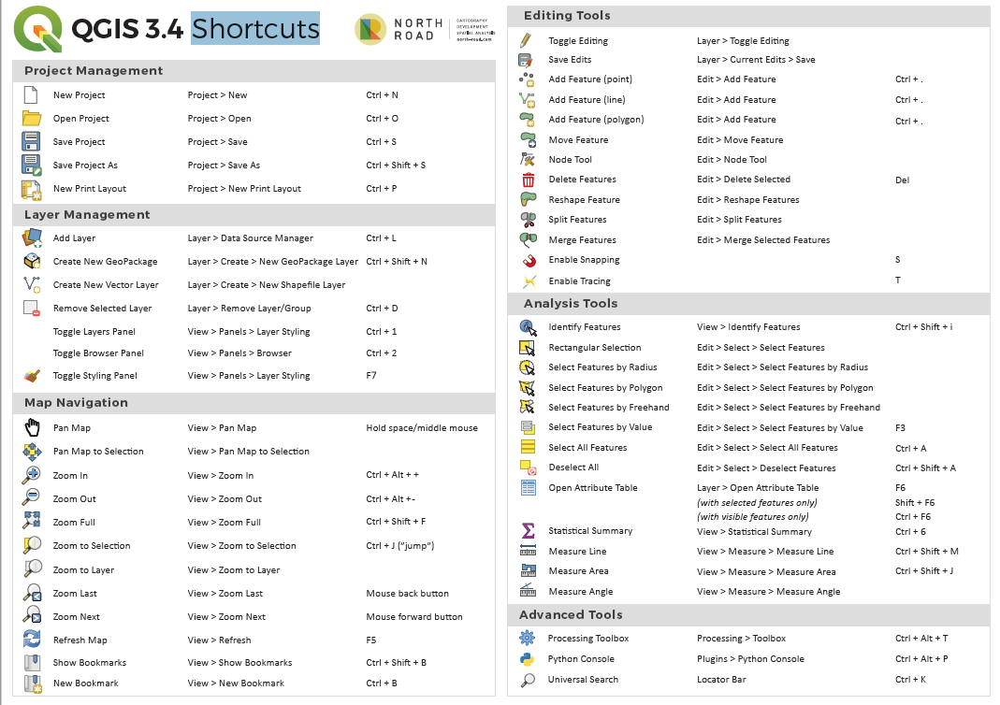

# Shortcuts QGIS IT/EN

Scorciatoie da tastiera per la GUI di QGIS (Keyboard shortcuts for the QGIS GUI)

## Perché questo repository (_Why this repository_)

L'interfaccia di QGIS sembra sempre la stessa ma in realtà sotto il cofano gira un motore potentissimo che puo' essere dominato attraverso delle shortcuts (scorciatoie da tastiera). _(The interface of QGIS always seems the same but in reality under the hood runs a powerful engine that can be dominated through shortcuts (keyboard shortcuts).)_

## Obiettivo (_Goal_)

Raccogliere e documentare tutte le shortcuts di base e di spiegare come personalizzarle e crearne di nuove. _(Collect and document all the basic shortcuts and explain how to customize them and create new ones.)_

## Shortcuts

- [In italiano](./shortcuts_it.md)
- [In English](./shortcuts_en.md)

## Output

Creare un PDF aggiornato partendo dall'ottimo spunto creato da [Nyall Dawson](https://north-road.com/qgis-3-0-shortcuts/): _(Create an updated PDF starting from the excellent idea created by)_

